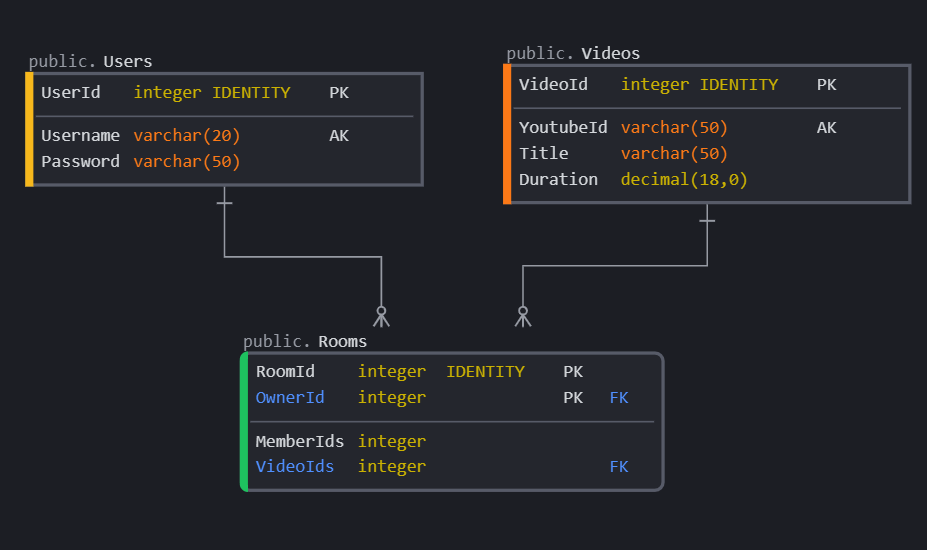

# <b>Eyepatch</b>

<b>This repository is outdated, please see the following for more information about Eyepatch:</b>
- [Backend server / database][1]
- [Messaging server][2]
- [Frontend code][3]

[1]: https://github.com/mschien/eyepatch-server
[2]: https://github.com/mschien/eyepatch-messaging
[3]: https://github.com/mschien/eyepatch-client

## Database Schema
The Database is fairly simple, storing users and videos to be assigned using many to one relationships to the various rooms.

